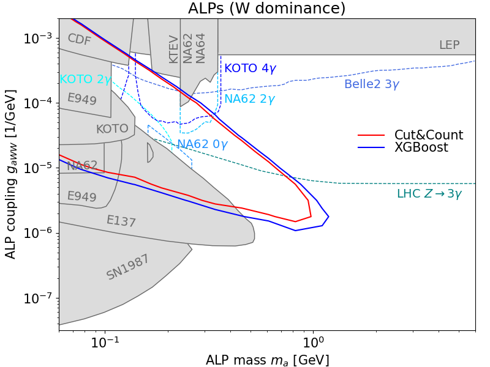

# **ALP vs. Background Classification using XGBoost**

## **1. Introduction**  
In high-energy particle physics, the search for new particles beyond the Standard Model is a fundamental goal. One such hypothetical particle is the Axion-Like Particle (ALP), which is predicted to decay into two photons. Detecting and distinguishing this two-photon signal from background events is crucial for identifying potential ALP signatures.

The FASER experiment at CERN is designed to detect new physics in the far-forward region of the Large Hadron Collider (LHC). However, the current FASER detector lacks the spatial resolution needed to resolve individual photons from ALP decays. To overcome this limitation, an upgraded preshower detector with high-granularity silicon sensors has been proposed. This enhancement aims to distinguish closely spaced photon pairs, enabling the identification of ALP decay events.

Despite this upgrade, background events—primarily caused by neutrino interactions—can produce energy deposition patterns similar to two-photon signals. To address this challenge, this project explores the use of machine learning, specifically **XGBoost**, to classify events based on features extracted from energy depositions in the preshower detector. By training the model on simulated data, we aim to improve the discrimination between signal (ALP decays) and background (neutrino interactions), enhancing the discovery potential of the FASER experiment.

---

## **2. Project Overview**  
- **Goal**: Use machine learning (XGBoost) to distinguish between ALP decay (two-photon signal) and background (neutrino interactions) in the FASER preshower detector.  
- **Dataset**: Simulated energy depositions from the preshower detector at CERN.  
- **Approach**:  
  - **Generate signal and background samples**  
  - **Extract preshower variables from detector energy depositions**  
  - **Train and evaluate XGBoost model**  
  - **Save model and apply it to classify events**  

---

## **3. Data Generation & Preprocessing**  
The dataset used in this project was generated through a multi-step pipeline:

1. **Signal Sample Generation**:  
   - ALP signal events were simulated using the **FORESEE** software ([GitHub Repo](https://github.com/KlingFelix/FORESEE)), producing `.hepmc` files.  
   - These `.hepmc` files were then fed into **Allpix2** ([GitLab Repo](https://gitlab.cern.ch/allpix-squared/allpix-squared)) to simulate energy depositions in the preshower detector.

2. **Background Sample Generation**:  
   - Neutrino background events were generated **directly** using Allpix2.

3. **Feature Extraction**:  
   - The output of Allpix2 consists of **ROOT files** containing energy depositions in the detector.  
   - From these ROOT files, **preshower variables** were calculated to serve as input features for the machine learning model.  

4. **Machine Learning Input Preparation**:  
   - The extracted variables from signal and background events were compiled into a structured dataset.  
   - These features were then used to train an **XGBoost** classifier.

---
## **4. Machine Learning Approach**  

### **4.1 Data Preparation**  
The dataset consists of simulated energy depositions in the FASER preshower detector. Signal samples (ALP decays) are generated using **FORESEE**, while background samples (neutrino interactions) are generated with **Allpix2**. The energy depositions are extracted from ROOT files using `uproot`, and relevant features are selected for training.  

- Background samples: `genie_numu.root`, `genie_anumu.root`, `genie_nue.root`  
- Signal sample: `signal.root`  
- Features are computed and labeled (`is_signal = 1` for signal, `0` for background).  

📌 **See [notebook/analysis.ipynb](notebook/analysis.ipynb) for full implementation.**  

---

### **4.2 Model Training & Evaluation**  
A **XGBoost classifier** is used to distinguish between signal and background. The dataset is split into **80% training, 20% testing**, and the model is trained with the following parameters:  

- **Binary classification (`binary:logistic`)**  
- **Max depth = 4, Learning rate = 1.0**  
- **100 estimators with early stopping (10 rounds)**  

Performance is evaluated using **log-loss** on training and validation sets, and feature importance is analyzed using **SHAP values**.  

📌 **See [notebook/analysis.ipynb](notebook/analysis.ipynb) for full details.**  

---

### **4.3 Appending XGBoost Scores**  
Once the model is trained, the XGBoost score is appended to the original ROOT files using:  

📌 **[scripts/append_bdt.py](scripts/append_bdt.py)** → Adds the XGBoost score to the ROOT file for further analysis.  

---

### **4.4 Signal & Background Yields Calculation**  
To determine the final expected number of signal and background events after applying an XGBoost score cut, the script:  

📌 **[scripts/calc_yields_bdt.py](scripts/calc_yields_bdt.py)** → Applies the score cut and calculates the final event yields, saving the results in `ALP-W_cutyields.npy`.  

### **4.5 Interpretation in Terms of FASER Reach**  
The results are interpreted in the context of **FASER’s sensitivity to ALPs**. The significance of the signal is calculated for each point in the **signal parameter grid**, following the method recommended in [arXiv:2009.07249](https://arxiv.org/abs/2009.07249).  

The significance calculation is performed using the tools provided in:  
📌 **[FORESEE-Preshower](https://gitlab.cern.ch/jsabater/foresee-preshower)**  

---

### **4.6 Exclusion Plot**  
An **exclusion plot** is generated based on the calculated significances, setting constraints on ALP production in FASER.  

The exclusion limits are obtained using:  
📌 **[FORESEE-Preshower](https://gitlab.cern.ch/jsabater/foresee-preshower)**  
#### **FASER Reach Exclusion Plot**  

---

---

## **6. Results & Findings**  
While the interpretation of the results requires some background in particle physics, a key takeaway is that the XGBoost-based approach outperforms the traditional Cut & Count method. This demonstrates the advantage of using machine learning techniques to enhance sensitivity in the search for new physics.

---

## **7. How to Run the Project**  
### 🚀 **Setup Instructions**  
1. Clone the repository:  
   ```bash
   git clone https://github.com/sabateri/photon_identification_FASER.git
   cd photon_identification_FASER
2. Run **[notebook/analysis.ipynb](notebook/analysis.ipynb)** to train the XGBoost model and save the model file
3. Run **[scripts/append_bdt.py](scripts/append_bdt.py)** to append the BDT scores to the signals
4. Run **[scripts/calc_yields_bdt.py](scripts/calc_yields_bdt.py)** to calculate the signal yields for each signal point

## **8. Todo**  
Currently, only the training step is available, as these are the only files uploaded to the Git repository. The remaining steps require additional files, which need to be hosted in a publicly accessible location to enable anyone to run the complete workflow.
